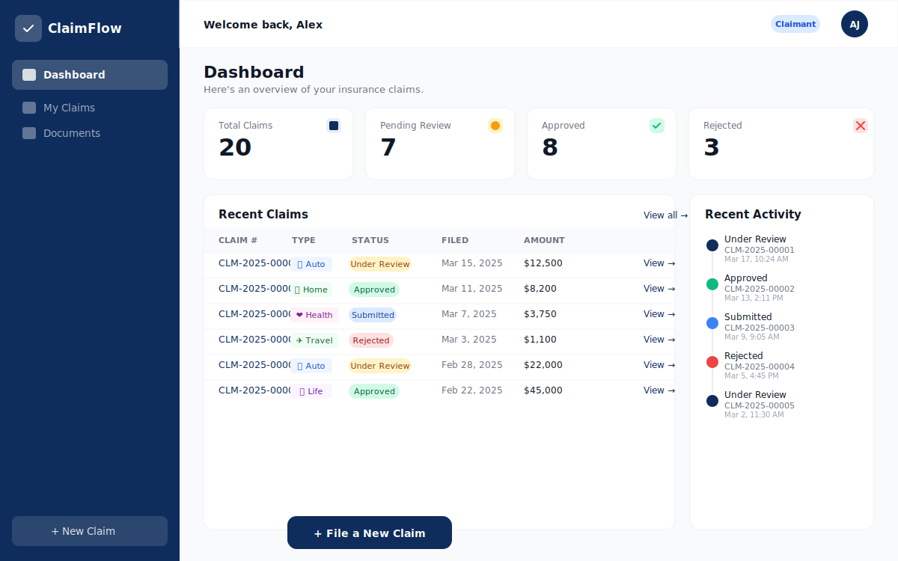

# ClaimFlow — Insurance Claims Portal

<p align="center">
  
  
  
  
  
  
  
  
  
  
  
  
  
  
  
</p>

<br/>

A full-stack insurance claims management portal built with Next.js 14 App Router, MongoDB, and NextAuth.js v5.

## Screenshot



## Tech Stack

- **Framework**: Next.js 14 (App Router)
- **Language**: TypeScript (strict mode)
- **Database**: MongoDB with Mongoose
- **Auth**: NextAuth.js v5 (JWT strategy)
- **File Uploads**: Native FormData API (stored on disk)
- **Email**: Nodemailer (console transport for dev)
- **Styling**: Tailwind CSS
- **Forms**: React Hook Form + Zod
- **State**: Zustand
- **Animations**: Framer Motion
- **Charts**: Recharts — interactive donut ring chart with animated segments and hover tooltips on the Statistics page

## Setup

### 1. Clone and install

```bash
npm install
```

### 2. Configure environment

```bash
cp .env.example .env.local
```

Edit `.env.local` and fill in:

```env
MONGODB_URI=mongodb://localhost:27017/claimflow
NEXTAUTH_SECRET=<generate with: openssl rand -base64 32>
AUTH_SECRET=<same value as NEXTAUTH_SECRET>
NEXTAUTH_URL=http://localhost:3000
UPLOAD_DIR=./uploads
```

### 3. Seed the database

```bash
npm run seed
```

### 4. Run development server

```bash
npm run dev
```

Visit [http://localhost:3000](http://localhost:3000)

## Demo Credentials

| Role      | Email                  | Password       |
|-----------|------------------------|----------------|
| Claimant  | claimant@demo.com      | Claimant123!   |
| Adjuster  | adjuster@demo.com      | Adjuster123!   |
| Manager   | manager@demo.com       | Manager123!    |

## Project Structure

```
/app
  /api              ← API Routes (backend)
    /auth           ← Registration + NextAuth handler
    /claims         ← CRUD for claims
    /documents      ← File upload/download/delete
    /admin          ← Queue, assign, stats
  /(auth)           ← Login, Register (no sidebar)
  /(portal)         ← Claimant interface (sidebar)
    /dashboard      ← Summary cards + recent claims
    /claims         ← Claims list + new claim form
    /documents      ← Document library
  /(admin)          ← Adjuster/Manager interface
    /adjuster/queue ← Filterable claim queue
    /adjuster/[id]  ← Claim review + status update
/components
  /ui               ← Badge, Button, Card, Input, Skeleton, Spinner, Modal
  /claims           ← ClaimStatusBadge, ClaimTypeIcon, StatusTimeline, ClaimsTable
  /forms            ← FileUploadZone, StepIndicator
  /layout           ← PortalSidebar, AdminSidebar, Header, ErrorBoundary
  /charts           ← StatusDonutChart (Recharts, client component)
/lib
  db.ts             ← MongoDB connection
  auth.ts           ← NextAuth config
  validations.ts    ← Zod schemas
  mailer.ts         ← Nodemailer
  auditLog.ts       ← Audit log helper
/models             ← Mongoose schemas
/hooks              ← useClaims, useFileUpload
/types              ← TypeScript interfaces
/scripts
  seed.ts           ← Database seeder
```

## Architecture

- **Auth flow**: Credentials-based with JWT. Session attached to every request via NextAuth v5 `auth()`.
- **Role-based access**: Middleware redirects unauthenticated users to `/login` and wrong-role users to their home.
- **File uploads**: Files are stored in `./uploads/` on disk. The API route streams files back with correct MIME types.
- **Audit logging**: Every mutating API call creates an `AuditLog` entry with action, user, and metadata.
- **Email**: Console transport in dev (logs to terminal). Set SMTP vars for production.

## Dataset Credit

Seed data structure inspired by the [Kaggle Auto Insurance Claims Dataset](https://www.kaggle.com/datasets/buntyshah/auto-insurance-claims-data) by Bunty Shah.
